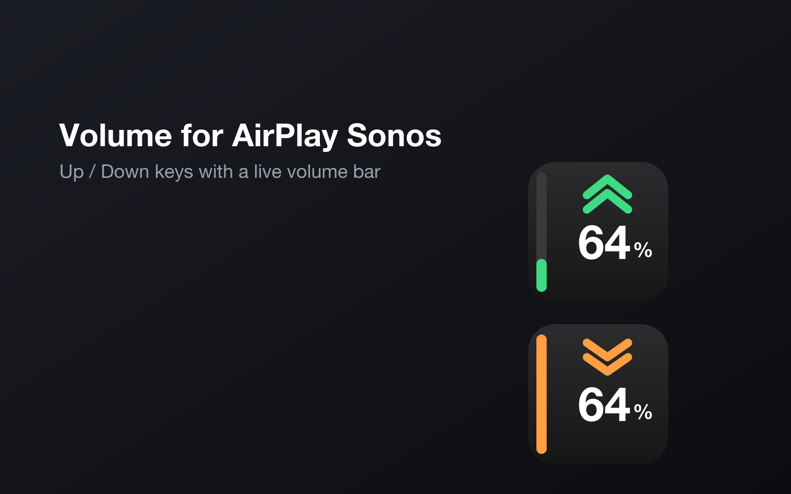
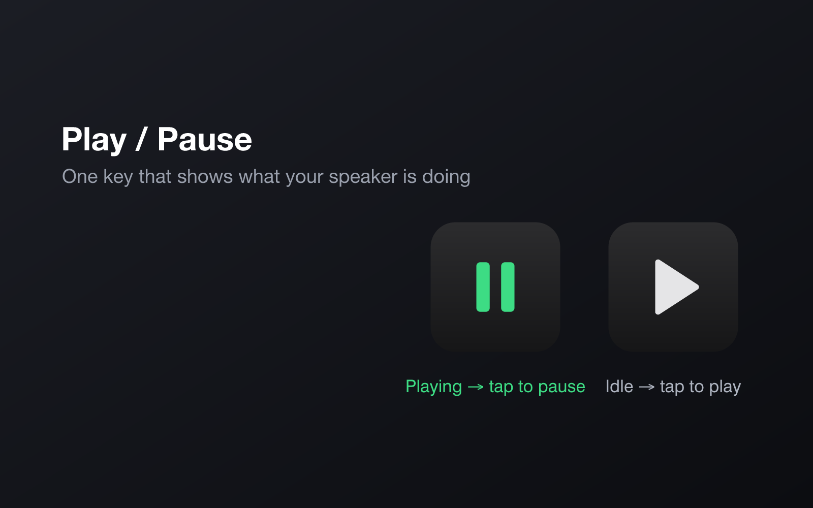
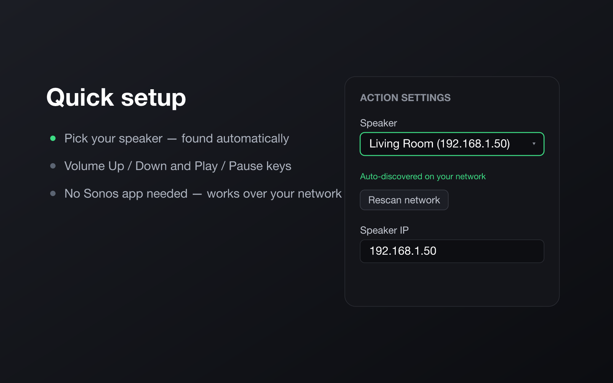

# Volume for AirPlay Sonos

[](https://github.com/danilapisarev/streamdeck-sonos-volume/releases/latest)
[](https://github.com/danilapisarev/streamdeck-sonos-volume/releases)
[](LICENSE)

A Stream Deck plugin for Sonos speakers — including speakers playing an AirPlay
stream — with **Volume Up**, **Volume Down**, and **Play / Pause** keys.
Everything is controlled through the Sonos device API over your local network, so
it works regardless of whether the audio source is AirPlay, a streaming service,
or line-in. Speakers can be picked from an auto-discovery list, no IP hunting
required.



> **Disclaimer:** This is an independent, third-party plugin. It is **not
> affiliated with, sponsored by, or endorsed by Sonos, Inc. or Apple Inc.**
> "Sonos" and "AirPlay" are trademarks of their respective owners and are used
> here only to describe compatibility.

## Download

**[⬇ Download the latest `.streamDeckPlugin`](https://github.com/danilapisarev/streamdeck-sonos-volume/releases/latest/download/com.danila.sonos-volume.streamDeckPlugin)**

Double-click the downloaded file to install it into the Stream Deck app (6.9+),
then add the buttons and enter your speaker's IP (see [Configuration](#configuration)).
All releases are on the [Releases page](https://github.com/danilapisarev/streamdeck-sonos-volume/releases).

## Actions

- **Volume Up** — raises the speaker volume by the configured step on each press.
- **Volume Down** — lowers the speaker volume by the configured step on each press.
- **Play / Pause** — toggles playback and shows the speaker's state: a ▶ play
  glyph when idle (press to play) and a green ⏸ pause glyph while playing (press
  to pause).

The volume keys share the same settings (speaker IP + volume step). Raising the
volume on a muted speaker also unmutes it; a ⚠ is shown only when the speaker
can't be reached.

### Live play/pause state



The Play / Pause key reads the speaker's transport state on the same poll loop as
the volume keys, so the icon stays correct even when playback is started or
paused elsewhere (the Sonos app, AirPlay, or another source). A press updates the
icon immediately and the poll confirms the real state shortly after.

### Finding your speaker

Open any action's settings and the **Speaker** dropdown lists the Sonos speakers
discovered on your network — pick one and the IP is filled in for you. Use
**Rescan network** if a speaker was off when the panel opened, or type the IP
manually.

### Live volume on the key

Each key redraws itself with the speaker's **current volume**: direction
chevrons (green up / amber down), the volume percentage as a large number, and a
vertical fill bar on the left edge (switchable to the right). The display updates
when the key appears, after every press, and on a short poll loop — so it stays
correct even when the volume is changed elsewhere (the Sonos app, the AirPlay
source, or the other button). A muted speaker is shown greyed out with a 🔇
badge.

**Designed for a vertical pair** — place **Volume Down directly under Volume
Up** and their side bars line up into a single continuous volume column: the
lower key shows 0–50%, the upper key shows 50–100%, and the fill grows from the
bottom of the lower key up through the top of the upper key.

The live image is generated as an SVG at runtime (`src/icon.ts`) and pushed with
`action.setImage(...)`. The static default icons (shown in the action list and
before a speaker is reachable) are produced from the same design by
`npm run icons` (see `scripts/gen-icons.mjs`).

## Requirements

- Elgato Stream Deck (any model with keys) + Stream Deck software 6.9 or later
- macOS 12+ or Windows 10+
- A Sonos speaker on the same local network

## Installation (from source)

```bash
# Install dependencies
npm install

# Build the plugin (outputs to com.danila.sonos-volume.sdPlugin/bin/plugin.js)
npm run build

# Enable Stream Deck developer mode (once)
streamdeck dev

# Link the plugin into the Stream Deck app
streamdeck link com.danila.sonos-volume.sdPlugin

# Rebuild + reload while developing
npm run watch
```

You can also double-click a packaged `.streamDeckPlugin` file to install it. To
package one:

```bash
streamdeck pack com.danila.sonos-volume.sdPlugin
```

## Configuration



1. Drag **Volume Up** and **Volume Down** onto two Stream Deck keys, with
   **Volume Down directly below Volume Up** (vertical pair). Add a **Play /
   Pause** key wherever you like.
2. On each key, open the Property Inspector and pick your speaker from the
   **Speaker** dropdown (it auto-discovers speakers on your network). You can also
   enter the **IP address** manually — find it in the Sonos app under **Settings →
   System → About My System**.
3. Optionally set the **Volume Step** (1%, 2%, 5%, or 10% — default 2%), the
   **Volume Bar** side (left or right), and whether the key shows the **Volume %**
   number (hide it on one key of a pair to avoid showing the number twice).

> Tip: enter the same IP (and same bar side) on both buttons so they control the
> same speaker and form one continuous gauge.

## How it works

- Built with the [Elgato Stream Deck SDK](https://developer.elgato.com/documentation/stream-deck/)
  (`@elgato/streamdeck`).
- Uses the [`sonos`](https://github.com/bencevans/node-sonos) library to read and
  set volume, read transport state, and toggle playback over UPnP, plus SSDP for
  network discovery.
- All actions share a single cached Sonos connection per speaker IP and one poll
  loop that reads volume, mute, and playback state for every speaker in use (see
  `src/actions/sonos-volume.ts`). Each volume press reads the current volume
  first, so stepping always starts from the speaker's real level even if it was
  changed elsewhere.
- Discovery runs on the plugin (Node) side on request from the Property Inspector
  and is cached briefly, so opening settings lists speakers without re-scanning
  the network every time.

## Project structure

```
src/
  plugin.ts                    # registers the actions and connects to Stream Deck
  actions/sonos-volume.ts      # live tiles/polling, SSDP discovery, Volume Up/Down + Play/Pause
  icon.ts                      # runtime SVG renderers for the live volume and play/pause images
  types/sonos.d.ts             # minimal type declarations for the `sonos` package
scripts/
  gen-icons.mjs                # regenerates the static PNG icons (npm run icons)
com.danila.sonos-volume.sdPlugin/
  manifest.json                # plugin + action definitions
  ui/volume-settings.html      # Property Inspector for the volume keys
  ui/playpause-settings.html   # Property Inspector for the play/pause key
  imgs/                        # plugin and action icons
  bin/plugin.js                # build output (generated)
```

## License

MIT
